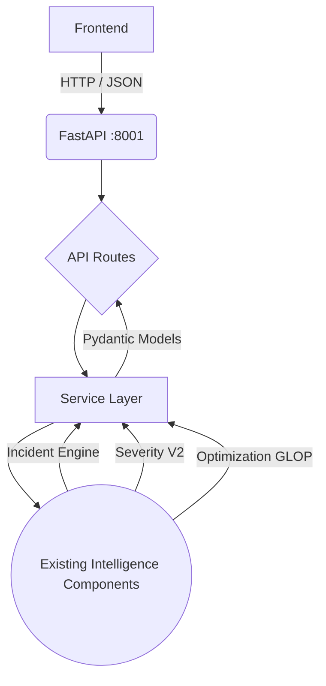

# PS20 FastAPI Phase 2 API Contracts

## 1. Phase Objective
The objective of Phase 2 is to establish the core FastAPI HTTP boundary, defining formal Pydantic Request and Response schemas that safely wrap the existing machine learning intelligence components without duplicating business logic, modifying the ML foundation, or relying on fabricated test data.

## 2. API Architecture

## 3. Endpoint List
- `GET /health`
- `POST /reports`
- `GET /incidents`
- `GET /incidents/{incident_id}/assessment`
- `POST /incidents/{incident_id}/reassess`
- `POST /allocations/optimize`

## 4. Request Schemas
* `ReportCreate`: Defines expected incoming disaster report fields (e.g., source, location, hazard type).
* `AssessmentReassessRequest`: For manual assessment triggers containing new evidence.
* `AllocationOptimizeRequest`: Basic wrapper referencing `incident_id` for solver targets.

## 5. Response Schemas
* `ReportResponse`: Basic ACK and processing status.
* `IncidentSummaryResponse`: List representation of incident markers for frontend.
* `AssessmentResponse`: Composite view containing verification status, severity, trajectory, needs, and priority data.
* `AllocationResultResponse`: Mapped from `AllocationResult` containing actual deployment edges and unmet demand.
* `UnsupportedHazardResponse`: Distinct, explicitly typed response for when `SeverityPredictorV2` encounters hazards outside of its domain.

## 6. Internal-to-API Mapping
- **`ml/src/incident/schemas.Report`** <-> `ReportCreate`
- **`ml/src/incident/schemas.IncidentCandidate`** <-> `IncidentSummaryResponse`
- **`ml/src/optimization/schemas.AllocationResult`** <-> `AllocationResultResponse`
- **`SeverityPredictorV2` dictionary** <-> `AssessmentResponse.severity`

## 7. Error Handling
Clean HTTP status code mappings are enforced:
- **400**: General processing failures.
- **404**: Incident ID or resource not found.
- **422**: Pydantic schema validation failures.
- **501**: Endpoints lacking implementation (e.g., full reassessment pipeline).

## 8. Unsupported Hazard Behavior
Unsupported hazards are gracefully handled. The `AssessmentResponse` replaces standard severity calculations with a strict `unsupported_hazard` object rather than inventing fake severity values.

## 9. Temporary In-Memory Repository Limitations
`GET /incidents` relies on `app/db/repositories.py`, a simple Python dictionary. This is strictly temporary for Phase 2 integration tests and **is not persistent**. State will disappear on application restart.

## 10. OR-Tools Allocation Limitations
The existing OR-Tools optimization engine uses a Linear Programming (LP) GLOP solver. It handles supply/demand balancing and determines quantity allocations. It **does not** perform geographic vehicle routing, ETA calculations, or GIS path planning. Any routing features in the frontend must be handled separately.

## 11. Reassessment Status
`POST /incidents/{incident_id}/reassess` currently returns `501 Not Implemented`. A proper reassessment must traverse the complete ML pipeline, and taking an API shortcut directly to severity would violate the architecture. 

## 12. Testing Results
- `GET /health` functions correctly.
- Post report and incident retrieval correctly utilize the mock DB.
- Invalid requests trigger 422 correctly.
- The `unsupported_hazard` endpoint fallback tests passed successfully.
- Endpoint Optimization schema successfully calls the service layer without raising 422s.
- Existing ML tests remain 100% frozen (98/98).

## 13. Port 8001 Architecture
The FastAPI application explicitly runs on port 8001. This preserves backwards compatibility with existing ML services that previously claimed 8001, effectively consolidating the stack into a unified monolith backend for current phases.

## 14. Security Considerations
- Tests do not require real `GEMINI_API_KEY` access.
- Endpoints do not leak Python stack traces.
- No DB credentials or API keys were committed or included in test data.

## 15. What remains for Phase 3
Phase 3 requires integrating a durable persistence layer (Supabase Database). We must design the table schema, replace the temporary in-memory repository with real Postgres queries, and correctly serialize all Pydantic objects.
