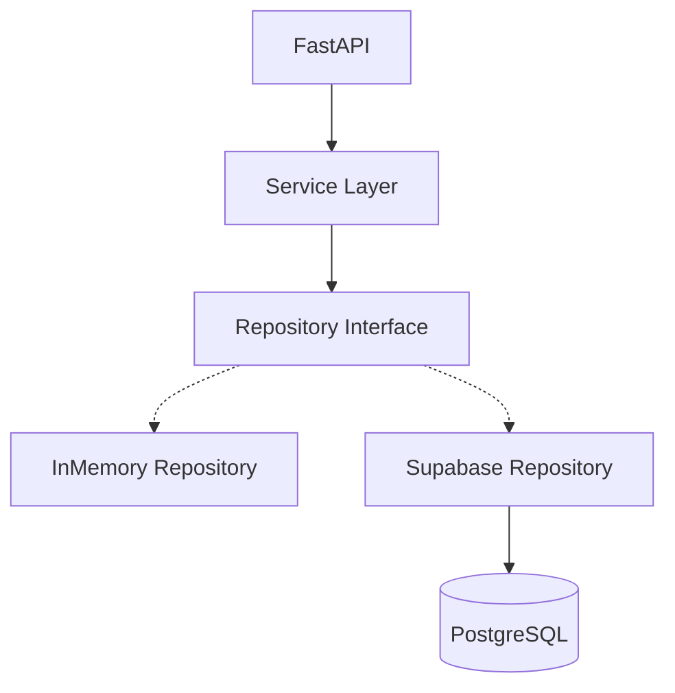

# SUPABASE PHASE 3A: DATABASE FOUNDATION

## 1. Objective
Establish the physical Supabase/PostgreSQL schema that accurately reflects the exact data structures produced and required by the existing PS20 Intelligence pipelines. This phase intentionally avoids duplicating business logic into SQL and strictly focuses on providing the schema and connectivity abstraction required for subsequent integration.

## 2. Database Architecture

The application strictly depends on the abstract `BaseIncidentRepository`. `InMemoryIncidentRepository` inherits from this, and the future `SupabaseIncidentRepository` will do the same, allowing zero-downtime swaps during testing.

## 3. Tables
The database schema strictly maps to the PS20 ML pipeline.
- `reports`: Raw ingested reports.
- `incidents`: Verified, synthesized disasters.
- `incident_evidence`: Mapping reports to incidents for provenance.
- `assessments`: Output of the assessment pipeline (Severity, Trajectory, Priority).
- `needs`: Resource requirements (quantities, urgencies).
- `resources`: The inventory available for distribution.
- `allocations`: GLOP optimizer output edges.
- `actions`: Proposed agentic actions.
- `approvals`: Human-in-the-loop review state.
- `audit_events`: Immutable event log.

## 4. Relationships
Key foreign keys:
- `incidents(incident_id)` is the central foreign key for `incident_evidence`, `assessments`, `needs`, `allocations`, `actions`, and `approvals`.
- All referential constraints use `ON DELETE CASCADE` where applicable, except `audit_events` which strictly uses `ON DELETE SET NULL` to preserve historical integrity.

## 5. Primary Keys
All primary keys are globally unique UUIDs (`uuid_generate_v4()`). This supports distributed generation and stable frontend referencing.

## 6. Foreign Keys
As defined in the `001_initial_ps20_schema.sql` migration, foreign keys strictly enforce the data model without circular dependencies.

## 7. Important Indexes
- `idx_reports_source_record`: Crucial for deduplication before ML ingestion.
- `idx_allocations_optimization_run`: Essential for retrieving complete allocation graphs for a specific solver run.
- `idx_assessments_incident_id`: Supports fast dashboard retrieval.

## 8. Timestamp Policy
All timestamps are `TIMESTAMPTZ` (Timezone-aware, effectively UTC). Distinct fields separate `first_observed_at` (domain time) from `created_at` (database insertion time).

## 9. RLS/Security Approach
**Row Level Security is explicitly ENABLED on all tables.**
However, because FastAPI operates as a trusted backend service connecting via the `SUPABASE_KEY` (service-role), it bypasses these policies. This design natively prevents direct public frontend access to the database entirely, maintaining the FastAPI layer as the strict boundary. No public `.env` credentials are exposed.

## 10. Environment Variables
- `SUPABASE_URL`: Extends pydantic settings.
- `SUPABASE_KEY`: Server-side service-role key.

## 11. Migration Location
`supabase/migrations/001_initial_ps20_schema.sql`

## 12. Supabase Client Architecture
`backend/app/db/client.py` provides `get_supabase_client()`. It fails safely and gracefully returns `None` if configuration is missing, preventing hard crashes during test execution where credentials are omitted.

## 13. Repository Abstraction
`BaseIncidentRepository` defines standard CRUD boundaries (`save`, `get`, `get_all`).

## 14. What is currently persisted
Nothing in Supabase yet.

## 15. What is NOT yet persisted
The Supabase Python SDK is not yet wired to the endpoints.

## 16. In-memory repository status
`InMemoryIncidentRepository` remains fully active and powers the current backend tests.

## 17. Connectivity-test result
Supabase connectivity not executed because credentials were not provided. The configuration loader and client mock tests pass successfully.

## 18. Security considerations
- `.env.example` contains placeholders.
- `test_db.py` uses `unittest.mock` strictly and does not embed actual secrets.
- `grep` checks confirm no leaks.

## 19. Test results
- `test_db.py`: 2/2 passed.
- `backend/tests`: 13/13 passed.
- ML tests: 98/98 passed (Frozen baseline).

## 20. Phase 3B next steps
**IMPLEMENTATION PHASE 3B: FULL DATABASE REPOSITORY IMPLEMENTATION.**
We will create `SupabaseIncidentRepository`, map the Pydantic models to SQL insert statements, wire the endpoints to the database, and effectively deprecate the in-memory repository.
