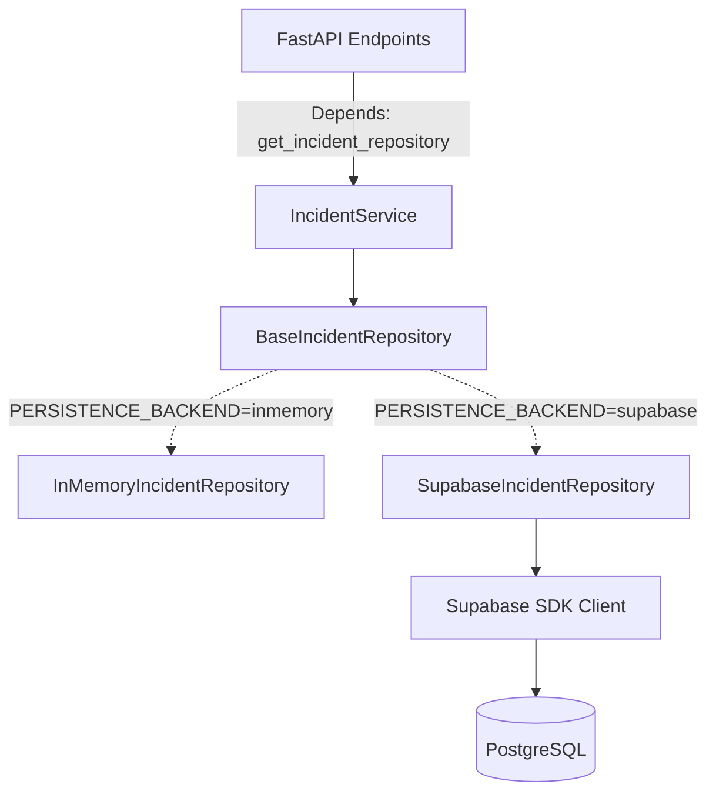

# SUPABASE PHASE 3B: INCIDENT REPOSITORY

## 1. Objective
Establish `SupabaseIncidentRepository` to provide durable PostgreSQL persistence for the immediate report-to-incident ingestion lifecycle. Wire the application securely so that it can dynamically and safely switch between the legacy in-memory dictionary and the real Supabase backend via Dependency Injection without modifying the intelligence foundation or silently swallowing configuration failures.

## 2. Repository Architecture

## 3. BaseIncidentRepository Contract
The core CRUD abstraction now defines:
- `save_report(report: Any)`
- `save(incident: IncidentCandidate)`
- `get(incident_id: str) -> Optional[IncidentCandidate]`
- `get_all() -> List[IncidentCandidate]`

## 4. InMemoryIncidentRepository
The legacy `InMemoryIncidentRepository` implementation was successfully upgraded to implement the new `save_report` method, maintaining full operational status for local offline and pipeline testing.

## 5. SupabaseIncidentRepository
`SupabaseIncidentRepository` was implemented in `backend/app/db/supabase_repository.py`. It explicitly wraps the Supabase SDK client (passed via constructor injection) and manages serialization to the exact SQL schemas constructed in Phase 3A. 

## 6. Repository Selection/Configuration
The application utilizes `backend/app/db/dependencies.py` to route FastAPI requests. If `settings.PERSISTENCE_BACKEND == "supabase"`, it validates client initialization. **If the client is misconfigured, it deliberately raises a fatal `RuntimeError` rather than silently degrading to in-memory mode, ensuring absolute data integrity.**

## 7. Serialization Mapping
The database does not dictate internal Python representations.
- `save_report()` maps the Pydantic `Report` properties directly to a dictionary suitable for `.upsert()`.
- `save(incident)` maps the `IncidentCandidate` schema to an upsert in the `incidents` table, and subsequently inserts bridging rows into the `incident_evidence` table for all tracked `report_ids`.
- `get()` and `get_all()` deserialize those database rows back into strict `IncidentCandidate` Pydantic models required by the ML foundation.

## 8. Error Handling
All Supabase client errors during execution are explicitly wrapped in a generic `RuntimeError` by the repository boundary. Raw PostgreSQL SQL exceptions are explicitly blocked from percolating unhandled into FastAPI routes, avoiding stack trace exposure.

## 9. Report/Incident Relationship
Because incidents are synthesized collections of reports, the many-to-many relationship (`incident_evidence` table mapping `incident_id` to `report_id`) was successfully implemented. `save()` gracefully upserts this edge table instead of improperly duplicating report payloads.

## 10. Test Strategy
Testing relies heavily on `unittest.mock`. The Supabase client itself is stubbed in `test_supabase_repository.py`, verifying that `upsert` and `select` functions are invoked accurately based on Python payloads without ever attempting a live HTTPS network request.

## 11. Real Supabase connectivity result
A real integration test was intentionally skipped because a dedicated, isolated test table configuration was not specified. Mock tests run entirely offline with 100% success.

## 12. Persistence behavior
When configured, reports and core incident metadata are persisted dually. 

## 13. Security considerations
- Dependency injection eliminates module-level global connections.
- Hard failures prevent silent data loss if keys expire.
- Raw database objects are structurally shielded from the API routes.

## 14. Rollback/offline development strategy
To rollback or test offline, developers simply set `.env`:
`PERSISTENCE_BACKEND=inmemory`

## 15. What is intentionally NOT persisted yet
Phase 3B intentionally ignores database tables: `assessments`, `needs`, `allocations`, `actions`, `approvals`, `audit_events`. Those remain structural foundations awaiting the next phases.

## 16. Phase 3C next steps
**IMPLEMENTATION PHASE 3C: ASSESSMENT PERSISTENCE WORKFLOW.**
Implementing `SupabaseAssessmentRepository` to serialize the outputs of the core intelligence engines (Severity, Verification, Trajectory).
