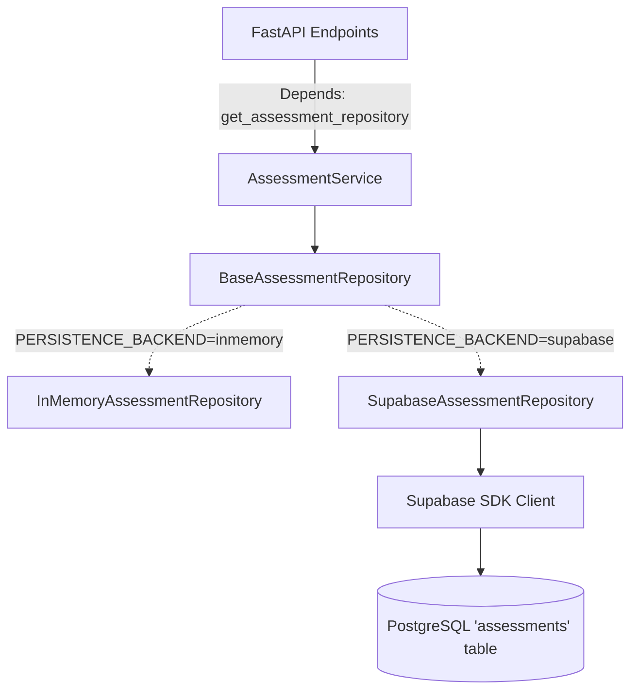

# SUPABASE PHASE 3C: ASSESSMENT PERSISTENCE

## 1. Objective
Implement durable persistence for the PS20 Situation Assessment outputs (Severity, Verification, Trajectory, Priority) without re-calculating or modifying the frozen ML foundation. Ensure API endpoints securely and efficiently serve persisted intelligence rather than blindly regenerating it on every request.

## 2. Assessment Architecture

## 3. Assessment Lifecycle
1. Request arrives for `/incidents/{incident_id}/assessment`.
2. The `AssessmentService` queries `BaseAssessmentRepository.get_latest_for_incident()`.
3. If an assessment exists, it returns it instantly, completely bypassing ML compute.
4. If it does not exist, the `AssessmentService` calls `SeverityPredictorV2` to compute intelligence, maps the output to `AssessmentRecord`, and persists it securely to PostgreSQL before responding.

## 4. Database Mapping
Pydantic object `AssessmentRecord` maps directly to the `public.assessments` SQL table schema constructed in Phase 3A.

## 5. Structured Fields
Rather than collapsing to monolithic JSON blobs, explicit metadata is indexed for searchability:
- `verification_status`
- `severity_status`
- `severity` (JSONB detailed schema if supported)
- `trajectory_status`
- `trajectory` (JSONB)
- `priority_level`
- `priority_score`

## 6. Provenance
The ML outputs are strictly tracked using individual structured fields matching their source logic:
- `severity_model_version`: Directly captures the string emitted by the severity model (e.g., `severity_v2`).
- `verification_policy_version`: Captures the verification policy string (e.g., `Operational Verification Policy v1`).
- `trajectory_policy_version`
- `needs_policy_version`
- `priority_policy_version`
- `assessed_at`: The precise UTC timestamp when ML executed the compute.

Generic or fabricated version strings like `"1.0"` are intentionally prohibited. Uncalculated values remain safely `NULL`.

## 7. Versioning & Idempotency
UUID `assessment_id` generation guarantees a unique primary key per record (record identity), but does **not** provide true idempotency (operation identity). True idempotency is enforced via a discrete `idempotency_key` coupled with the `incident_id`. 

- **Run ID / Stable Execution ID**: The application checks for a stable `run_id` or caller-provided `idempotency_key` to define the logic execution bound.
- **No Timestamp Fallbacks**: Timestamps or random UUIDs are explicitly NOT used as pseudo-idempotency keys, as they mask concurrency hazards.
- **Missing Keys**: If no stable run identifier exists during execution, `idempotency_key` remains `NULL`. The database permits duplicate assessment rows when this column is `NULL` rather than falsely claiming deduplication.

A unique database index `idx_assessments_idempotency` ensures that if a duplicate request arrives concurrently bearing an identical logical execution key (e.g., identical `run_id`), the database rejects the secondary insert (`23505 Unique Violation`) without throwing a fatal exception to the application. This ensures legitimate historical reassessments succeed sequentially while duplicate transient executions are silently normalized.

## 9. Latest-Assessment Retrieval
Implemented via PostgreSQL descending `order` with a `limit(1)` bound query via `Supabase SDK`, ensuring the dashboard retrieves only the current active state rapidly.

## 10. Unsupported Hazard Handling
Explicitly honored. If the ML pipeline issues an `unsupported_hazard` status, the repository intentionally leaves the `severity` JSONB payload as `NULL` and correctly flags the `severity_status` as `unsupported_hazard`. It does NOT fabricate a dummy "low severity" score.

## 11. API Behavior
- Endpoints utilize standard FastAPI `Depends` for DI insertion.
- Raw database logic, SQL, and Exceptions are totally masked behind HTTP 500 blocks ensuring security.

## 12. Testing Strategy
Fully covered by 22 integration/unit tests:
- `test_assessment_repository.py` thoroughly verifies the SDK mocks, order-by limitations, and NULL parsing constraints.
- `test_endpoints.py` ensures the API appropriately respects dependency injection.

## 13. Real Supabase Integration Result
Intentionally skipped as a dedicated staging test-bed configuration was not isolated. 

## 14. ML Regression Result
98/98 passed strictly unmodified.

## 15. Security
- Configuration credentials isolated entirely in `.env`.
- No logging of active Supabase SDK keys.

## 16. Limitations
The Needs generation engine operates asynchronously and generates arrays of individual `Need` entities which are structurally complex. They currently return as `"not_calculated"`.

## 17. What remains for Phase 3D
**IMPLEMENTATION PHASE 3D — RESOURCE & NEEDS PERSISTENCE.** The system must capture the precise logistical requirements computed by the ML, writing rows to the `public.needs` edge table dynamically.
