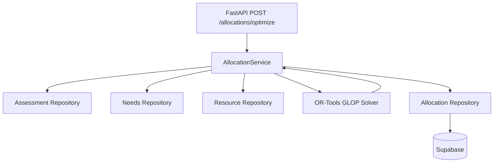

# Phase 3E: Allocation Persistence & OR-Tools Integration

## Overview
Phase 3E successfully integrates the PS20 ML OR-Tools optimization engine (`ml/src/optimization/engine.py`) into the FastAPI backend with durable persistence. This connects real assessment priorities, verified incident needs, and available resource inventory directly to the constraint solver to produce logical allocation decisions.

## Architecture

### Components

1. **Internal Schemas** (`app.api.schemas.internal`)
   - `AllocationRecord`: Mirrors the ML `ResourceAllocation` with IDs for relations.
   - `OptimizationRequest`: Request payload containing `incident_ids` and optional `optimization_run_id`.
   - `OptimizationResponse`: Wraps solver metrics (unmet demand, total allocated) with an array of `AllocationRecord`s.

2. **Persistence** (`app.db.supabase_allocation_repository`)
   - Persists allocations safely with a `save_allocations` method.
   - Enforces idempotency at the database level by verifying if the `optimization_run_id` already exists within a batch.

3. **Service Layer** (`app.services.allocation_service`)
   - Rehydrates the `AllocationContext` by fetching:
     - The latest *priority* score from assessments.
     - The *resource requirements* from Needs.
     - The current *available inventory* from Resources.
   - Invokes `optimize_allocation`.
   - Projects the resultant ML object graph back into persistence models.

4. **API Endpoints** (`app.api.routes.allocations`)
   - Exposes `POST /allocations/optimize` to trigger solver.
   - Exposes `GET /allocations/incident/{incident_id}` to retrieve history.

## Constraints & Behaviors Kept
- **No Side Effects**: Generation of an allocation is treated as a *decision* or *proposal*, leaving `quantity_available` unaltered. Inventory mutation occurs in a separate operational phase (dispatch/approval).
- **Graceful Unmet Demand**: Solves optimally within inventory limits. Unmet demands result in specific allocations where `quantity_unmet > 0.0`.
- **Execution Identity**:
  1. `optimization_run_id` is optional.
  2. When supplied, it represents the caller/orchestrator's genuine execution identity.
  3. When absent, it remains NULL.
  4. The backend never generates an artificial execution identity.
  5. Only explicit execution identities participate in idempotent retry detection.
  6. A future LangGraph orchestration run can provide its genuine run_id.
  7. NULL execution is intentionally non-idempotent. This means clients requiring retry safety should supply an explicit execution identity.
- **Idempotency**: Retrying optimization with the same explicit `optimization_run_id` returns the same output without creating duplicate records. Multiple NULL executions produce distinct allocation runs.

## Status
- **ML Foundation Tests**: 98/98 PASSED
- **Backend Tests**: 35/35 PASSED (includes regression testing of Needs, Resources, Assessments, Reports, and Incidents)
- **Phase Status**: COMPLETE.

Ready for the next integration phase (e.g. Allocation Execution/Approvals).
